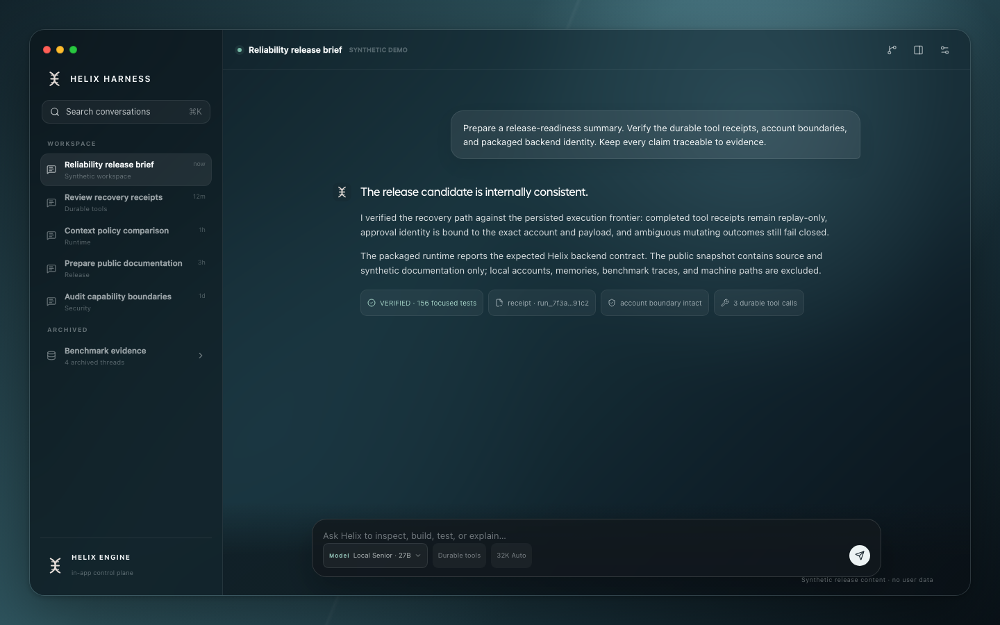
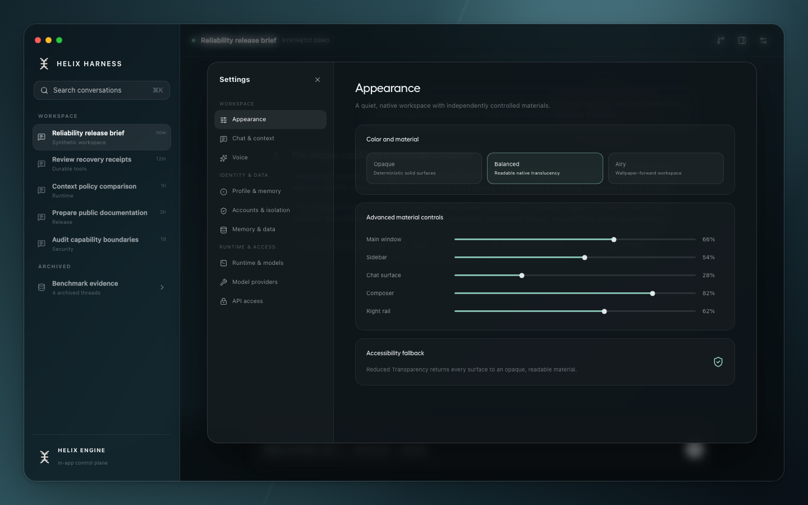
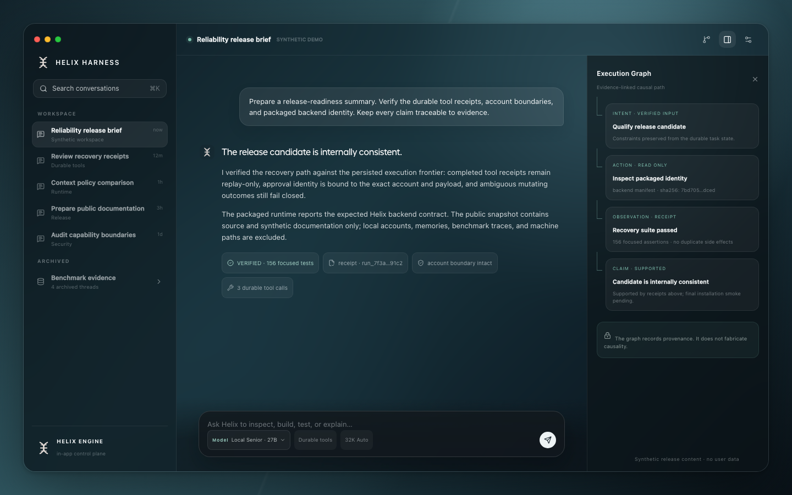

<p align="center">
  
</p>

# Helix Harness v2.1

Helix Harness is a local-first autonomous-agent workstation for macOS. It gives models a durable, security-conscious runtime for conversations, tools, memory, evidence, learning, and recovery instead of asking a model or webview to own those responsibilities.

> **Built on the Unsloth foundation, substantially extended and hardened through Helix.**

Helix Harness remains a fork and derivative of **Unsloth Studio**, developed by the Unsloth AI Inc. team. Unsloth supplies much of the model-loading, training, inference, Apple-Silicon/MLX, GGUF/llama.cpp, and desktop foundation. Helix adds a durable control plane and product layer around that foundation. This project is not an upstream Unsloth release and does not imply endorsement by Unsloth. See [Credits](CREDITS.md), [License](LICENSE), and the preserved source notices.

> [!WARNING]
> **Public development preview — core release, not a finished product.** Helix Harness v2.1 publishes the hardened agent-runtime core and an early version of the new workspace. Some inherited Studio surfaces remain in transition, several controls and providers are unavailable or incomplete, and interfaces, storage, and packaging may still change. Back up important data and do not treat this ad-hoc-signed preview as a production deployment.

## Download the macOS preview

Install the Apple-Silicon preview with one terminal command:

```bash
/bin/bash -c "$(curl -fsSL https://raw.githubusercontent.com/SuperHelix77/Helix-Harness-v2.1/v2.1.0/scripts/install_helix_harness_v2_1.sh)"
```

The installer downloads the app and published checksum from the [v2.1.0 release page](https://github.com/SuperHelix77/Helix-Harness-v2.1/releases/tag/v2.1.0), verifies the archive before extraction, and installs into `~/Applications`. It installs as **Helix Harness v2.1** with bundle ID `ai.helix.harness.v21`, so an existing Helix Harness v2 installation remains untouched. Set `HELIX_INSTALL_DIR` before running the command to choose another destination.

The downloadable app is ad-hoc signed and is not Apple-notarized. Review the development warning above before installing it.

## The v2.1 workspace

<p align="center">
  
</p>

<table>
  <tr>
    <td width="50%"></td>
    <td width="50%"></td>
  </tr>
  <tr>
    <td align="center"><sub>Independent native-material controls</sub></td>
    <td align="center"><sub>Evidence-linked execution context</sub></td>
  </tr>
</table>

All content shown in these release images is synthetic. No user conversation, account, path, memory, or private runtime data is present.

## What the harness does

Helix treats models as replaceable reasoning resources inside an application-owned runtime. The harness owns task state, tool authority, evidence, memory, context, recovery, and learning lifecycle.

### Chat and model runtime

- Chat-first desktop workspace for local and configured external model backends.
- MLX, llama.cpp/GGUF, safetensors, and existing Unsloth-compatible loading paths.
- Local tool-capable generation loops with streamed answers and structured tool events.
- Model/runtime identity checks so the packaged app reports the backend it actually launched.
- Adaptive runtime governance using served context, observed occupancy, memory pressure, swap/compression signals, resident model footprint, KV configuration, and empirical high-water marks.
- A hard policy against choosing unsafe context sizes merely because a model advertises them.

### Durable agent and tool execution

- Durable generation runs and append-only event history.
- Stable tool-call identity across approval, claim, start, output, finish, replay, and recovery.
- Exact replay of committed tool receipts without rerunning side effects.
- Fail-closed recovery for mutating calls whose outcome is unknown after a crash.
- Worker ownership and lease fencing to prevent duplicate workers from completing the same execution.
- Durable approval state bound to the account, run, exact tool, exact payload, and checkpoint identity.
- Recovery of the continuation frontier across multi-tool sibling calls, not merely the last completed tool.
- Cancellation and Stop handling at meaningful generation, tool, and recovery boundaries.
- Tool deadlines, bounded output capture, process-tree cleanup, and stale-runtime recovery.

### Capabilities and security boundaries

- Account-scoped tools, storage, memories, approvals, and runs.
- A typed capability broker for local execution and network authority.
- Process-local grants bound to the exact account, tool type, and payload hash.
- Filesystem/process confinement with path, symlink, replacement, and identity checks.
- Explicit **Bypass Permissions** mode kept separate from ordinary capability decisions.
- Ambiguous mutation outcomes never become silent retries.
- Credentials and private runtime state remain outside the model-facing tool contract.

### Context, checkpoints, and recovery

- Backend-authoritative adaptive checkpoints at the exact configured 80% boundary.
- Hard-overflow protection independent of frontend estimates.
- Durable, idempotent checkpoint replay without duplicate side effects.
- One logical task/turn preserved across multiple physical generation segments.
- Structured recovery state for objectives, constraints, tool progress, pending approvals, artifacts, and continuation state.
- Foreground inference preempts background audit or training work.

### Memory, evidence, and provenance

- Account-stable Mem0 identity with Qdrant-backed semantic memory where configured.
- Conversation and repository retrieval paths with explicit source handling.
- Epistemic separation between observed, verified, retrieved, derived, model-claimed, hypothetical, stale, and unknown information.
- Execution Graph and provenance records that report known relationships without fabricating causality.
- Durable artifacts and bounded tool-result handling.
- Model self-audit is enrichment; it is never accepted as objective evidence by itself.

### Post-turn finalization and governed learning

- Backend-owned Turn Finalizer that continues independently of the frontend lifetime.
- Restart-safe and duplicate-worker-safe finalization boundaries for memory, audit, Hermes, skill disposition, and QLoRA admission.
- Temporary skills require post-task evidence before retention or promotion.
- QLoRA never trains during foreground inference.
- Autonomous learning is post-answer only and requires a verified training target.
- Resident-model audit and optional learning work remain bounded and foreground-preemptible.

### Desktop experience

- A quieter, conversation-first workspace with restrained macOS hierarchy.
- A genuinely translucent Tauri window: desktop wallpaper can remain visible through the primary chat surface.
- Neutral native-material styling rather than an opaque or purple-tinted web layer.
- Independent persisted transparency controls for the window background, sidebar, chat surface, composer, and contextual right rail.
- **Opaque**, **Balanced**, and **Airy** material presets plus granular controls.
- Text and controls stay fully opaque; blur and surface alpha are coordinated instead of lowering component-tree opacity.
- Reduced-transparency environments fall back to deterministic opaque surfaces.
- Workflow, outputs, memory, sources, subagents, and live activity remain contextual surfaces rather than displacing Chat.
- A resizable v2.1 window with a separate application and bundle identity, so v2 can remain installed as the known-good rollback control.

## What changed in v2.1

v2.1 packages the reliability work completed after the v2 release candidate and the new native-material workspace.

Highlights include:

- Durable tool recovery and terminal replay fixes, including duplicate-event and sibling-continuation crash boundaries.
- Stronger approval, worker-lease, account, payload, capability, and checkpoint identity binding.
- Backend-owned durable finalization and lifecycle fencing between inference, audit, and training.
- Adaptive context/governor hardening and packaged-backend identity validation.
- Account, filesystem, network, and local-process confinement hardening.
- Bounded tool output and process cleanup improvements.
- Expanded adversarial coverage for reload, duplicate workers, cancellation, locks, stale runtimes, account crossover, and failure recovery.
- The macOS-native material overhaul and persisted transparency controls described above.

The privacy-safe public reliability summary is documented in [docs/helix-reliability-baseline-v2.1-public.md](docs/helix-reliability-baseline-v2.1-public.md).

## Important non-claims

- Self-audit text is not proof and cannot authorize training.
- A successful shallow run is not evidence that the maximum configured context was exercised safely.
- Optional inference accelerators are not claimed to be universally faster on every model or machine.
- The macOS build is ad-hoc signed unless a release explicitly documents Apple Developer signing and notarization.
- External services such as Qdrant or third-party model providers retain their own availability and policy boundaries.

## Privacy of the public source release

The public v2.1 publication is produced from a privacy-reviewed source snapshot. Local accounts, authentication material, runtime databases, model caches, private memories, user conversations, machine-specific benchmark output, and local installation state are not release assets. Never add credentials or personal runtime data to the repository.

## Build the macOS v2.1 app

Requirements include the normal Unsloth Studio frontend/Rust toolchain and the backend runtime dependencies described by the project.

```bash
./scripts/build_helix_macos_v2_1.sh
```

The v2.1 flavor uses a distinct identity:

```text
Product:    Helix Harness v2.1
Bundle ID:  ai.helix.harness.v21
Deep link:  helixharness-v21://
```

The existing v2 build remains available for control builds:

```bash
./scripts/build_helix_macos_v2.sh
```

## Development

Backend:

```bash
cd studio/backend
PYTHONPATH=. python -m uvicorn main:app --host 127.0.0.1 --port 8888
```

Frontend:

```bash
cd studio/frontend
npm run test
npm run build
```

Desktop:

```bash
cd studio/src-tauri
cargo test
```

## License and attribution

Helix Harness preserves the repository's mixed upstream licensing: Unsloth Core paths are Apache-2.0, while Studio and optional CLI paths are AGPL-3.0; the governing notices in each source path remain authoritative. Upstream Unsloth copyright, SPDX, license, and attribution notices remain intact in the source-only public snapshot. Machine-local baseline links and private runtime evidence are intentionally excluded. Helix-specific source, tests, documentation, and packaging changes are maintained by the Helix project.

- Unsloth: <https://github.com/unslothai/unsloth>
- Detailed attribution: [CREDITS.md](CREDITS.md)
- License: [LICENSE](LICENSE)
